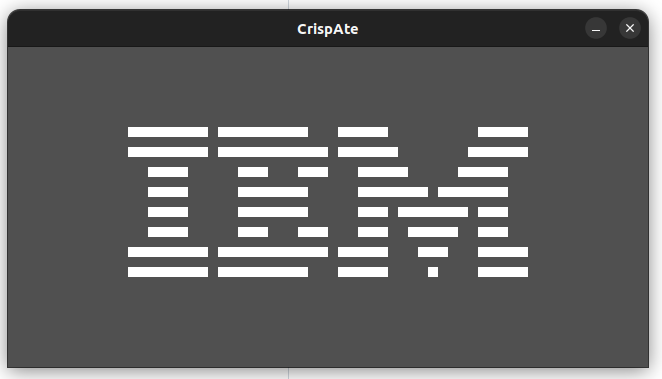

# crisp-ate
A chip-8 emulator in Rust, using raylib for graphics. For emulation learning purposes.

###### (currently being developed on Ubuntu, but with a cross-platform intention + libraries)

Based on:

- https://multigesture.net/articles/how-to-write-an-emulator-chip-8-interpreter/
- https://tobiasvl.github.io/blog/write-a-chip-8-emulator/



# Usage

```bash
$ git clone https://github.com/adoroburrito/crisp-ate
$ cd crip-ate
$ cargo run "<path to chip-8 rom>"
```

# TO-DO
- [X] basics
  - [X] memory (8-bit array with 4096 positions)
  - [X] registers
  - [X] opcode enums
  - [X] load program into memory
- [ ] emulation
  - [X] fetch and decode opcode at program counter
  - [ ] opcode execution
    - [ ] Call -> 0NNN (NNN)
    - [X] ClearDisplay -> 00E0
    - [X] Return -> 00EE
    - [X] Jump -> 1NNN (NNN)
    - [X] CallSubRoutine -> 2NNN (NNN)
    - [X] SkipIfVXEquals -> 3XNN (X, NN)
    - [X] SkipIfVXNotEqual -> 4XNN (X, NN)
    - [X] SkipIfVXEqualsVY -> 5XY0 (X, Y)
    - [X] SetVX -> 6XNN (X, NN)
    - [X] AddToVX -> 7XNN (X, NN)
    - [X] SetVXToVY -> 8XY0 (X, Y)
    - [X] SetVXToVXorVY -> 8XY1 (X, Y)
    - [X] SetVXToVXandVY -> 8XY2 (X, Y)
    - [X] SetVXToVXxorVY -> 8XY3 (X, Y)
    - [X] AddVYtoVX -> 8XY4 (X, Y)
    - [ ] SubtractVYFromVX -> 8XY5 (X, Y)
    - [ ] StoreLeastBitOfVXAndShiftVXRight -> 8XY6 (X)
    - [ ] SetVXToVYMinusVX -> 8XY7 (X, Y)
    - [ ] StoreMostBitOfVXAndShiftVXLeft -> 8XYE (X)
    - [X] SkipIfVXNotEqualVY -> 9XY0 (X, y)
    - [X] SetIAddress -> ANNN (NNN)
    - [X] JumpToAddress -> BNNN (NNN)
    - [ ] SetVXToBitwiseANDWithSaltAndRandom -> CXNN (X, NN)
    - [X] DrawSpriteAt -> DXYN (X, Y, N)
    - [ ] SkipIfKeyAtVXIsPressed -> EX9E (X)
    - [ ] SkipIfKeyAtVXIsNotPressed -> EXA1 (X)
    - [X] SetVXToDelayValue -> FX07 (X)
    - [ ] GetKeyToVX -> FX0A (X)
    - [X] SetDelayToVX -> FX15 (X)
    - [X] SetSoundToVX -> FX18 (X)
    - [X] AddVXToI -> FX1E (X)
    - [X] SetIToLocationOfVXChar -> FX29 (X)
    - [ ] StoreBinaryCodedDecimalVX -> FX33 (X)
    - [ ] StoreFromV0ToVXStartingFromI -> FX55 (X)
    - [ ] FillFromV0ToVXStartingFromI -> FX65 (X)
  - [X] draw frame (with raylib)
  - [ ] play sound timer beep (with raylib)
- [ ] completeness
  - [ ] unit tests
      - [X] opcode decode
      - [ ] opcode execution
  - [ ] test system with test roms
      - [X] IBM Logo
      - [ ] corax89’s chip8-test-rom
      - [ ] The BonCoder/BestCoder test
  - [ ] test system with games
